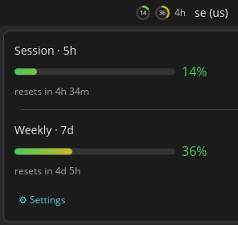

# cosmic-applet-claude-usage

A minimal COSMIC panel applet showing Claude Code usage as a quiet color-coded
indicator. Green → amber → red as you approach your session (5h) or weekly (7d)
limit. Click for exact percentages and reset countdowns; right-click for
settings. Several indicator styles (dot, bars, ring, vertical bar) and
time-to-reset displays, all previewed live in the settings panel.



## Data source

Reads the last line of `~/.claude/usage-history.jsonl`. Values are "last known"
between sessions; the indicator dims when data is older than `stale_after`.

Claude Code only exposes the 5-hour and 7-day rate-limit figures on the JSON it
pipes to a **statusLine** command — nothing writes `usage-history.jsonl` on its
own. So the applet ships a small statusLine that persists them: see
[Feeding the applet](#feeding-the-applet).

## Feeding the applet

[`contrib/usage-writer.sh`](contrib/usage-writer.sh) is a statusLine that reads
Claude Code's render JSON and appends the session/weekly usage to
`~/.claude/usage-history.jsonl` in the format the applet expects (deduping
identical samples, with a 120 s heartbeat so the staleness clock stays fresh).
The figures only appear for Claude.ai Pro/Max accounts, after the first API
response of a session. It needs `jq`.

### Install it

```bash
just install-statusline          # or: bash contrib/install-statusline.sh
```

Installed from the `.deb`/tarball instead of a checkout? The same scripts ship
at `/usr/share/cosmic-applet-claude-usage/` (and in the tarball's `contrib/`),
so run `bash /usr/share/cosmic-applet-claude-usage/install-statusline.sh`.

This copies the writer to `~/.claude/usage-writer.sh` and wires it into Claude
Code. If you **have no statusLine**, it sets one (backing up `settings.json`
first); the writer also prints a compact `session N% · weekly N%` line for your
terminal. If you **already have a statusLine**, it is left untouched and the
installer prints how to chain the writer into it. Re-running is safe.

Verify feeding at any time (changes nothing; exits non-zero if not wired):

```bash
bash contrib/install-statusline.sh --check
```

> **If you regenerate your statusLine** — e.g. via Claude Code's `/statusline`,
> or by editing `settings.json`'s `statusLine` command — that overwrites
> whatever fed the applet, and feeding silently stops (the indicator will dim as
> data goes stale). Nothing wired through the statusLine can survive this, since
> the data is *only* available there. The most durable setup is to paste the
> **persist block** from `usage-writer.sh` into your *own* statusLine script, so
> it travels with your edits. After any statusLine change, re-run the installer
> or `--check` to confirm.

### Manual setup

Prefer to wire it yourself? Point `~/.claude/settings.json` at the script:

```json
"statusLine": { "type": "command", "command": "bash ~/.claude/usage-writer.sh" }
```

or, to keep an existing statusLine, tee the render JSON through the writer:

```bash
input=$(cat)
printf '%s' "$input" | bash ~/.claude/usage-writer.sh >/dev/null
printf '%s' "$input" | your-existing-statusline
```

Override the output path or heartbeat with the `CLAUDE_USAGE_HISTORY` and
`CLAUDE_USAGE_HEARTBEAT` environment variables. The writer and installer are
covered by `contrib/test-usage-writer.sh` and `contrib/test-install-statusline.sh`
(both run under `just test`).

## Install

After installing by any route below, add the applet to your panel:
**COSMIC Settings → Panel (or Dock) → Applets → add "Claude Usage"**.

### Prebuilt package (Pop!_OS / Ubuntu / Debian)

Grab the latest `.deb` from the [Releases page][releases] and install it:

    sudo apt install ./cosmic-applet-claude-usage_*_amd64.deb

For other distros, the release also ships a portable `*-x86_64-linux.tar.gz`
(binary + desktop entry) — drop the binary on your `PATH` and the `.desktop`
file in `~/.local/share/applications/`.

[releases]: https://github.com/osterbergsimon/cosmic-applet-claude-usage/releases

### Nix / NixOS (flake, prebuilt via Cachix)

A [Cachix][cachix] binary cache serves prebuilt builds, so installing skips
compiling libcosmic. Enable the cache, then install:

    cachix use cosmic-applet-claude-usage
    nix profile install github:osterbergsimon/cosmic-applet-claude-usage

Without the `cachix` CLI, add the substituter to your Nix config instead:

    extra-substituters = https://cosmic-applet-claude-usage.cachix.org
    extra-trusted-public-keys = cosmic-applet-claude-usage.cachix.org-1:2zrqPNPlHd1hO+hDmaZ73NJJ9ym+dCFfuUVQGmN63yk=

Declarative — add the input and pull the package in via the overlay (set the
substituter above in `nix.settings` so the build is fetched, not compiled):

```nix
# flake.nix
inputs.cosmic-applet-claude-usage.url =
  "github:osterbergsimon/cosmic-applet-claude-usage";

# in your nixosConfiguration / homeConfiguration modules:
nixpkgs.overlays = [ inputs.cosmic-applet-claude-usage.overlays.default ];
environment.systemPackages = [ pkgs.cosmic-applet-claude-usage ];  # or home.packages
```

then `sudo nixos-rebuild switch` (or `home-manager switch`).

[cachix]: https://app.cachix.org/cache/cosmic-applet-claude-usage

### Build from source — other COSMIC distros

> Compiles libcosmic from scratch — the first build is slow.


Needs a Rust toolchain, `just`, `pkg-config`, and `clang`/`libclang` (for
bindgen). Everything the applet renders with — Wayland, libxkbcommon, the Vulkan
loader, libGL — is dlopened at runtime and already present on a COSMIC desktop,
so you only add the build tools. Then:

    cargo build --release
    sudo just install                # → /usr/bin + /usr/share/applications
    # or: sudo just prefix=/usr/local install
    # uninstall: sudo just uninstall

### Dev iteration (this repo, on Nix)

Rust isn't global here; the toolchain + native deps come from the `flake.nix`
devShell, so `cargo`/`just` run inside `nix develop -c …`:

    nix develop -c just test
    nix develop -c just install-dev   # → ~/.local/bin (LD_LIBRARY_PATH-wrapped)

## Config

Stored via cosmic-config (`co.osterberg.ClaudeUsage` v1). Defaults are used on
first run and whenever a key is unset or unreadable. The settings panel only
offers reset displays the chosen style can render (e.g. `dual-ring` is ring-only;
`track` is an arc on rings, an under-bar on horizontal bars, a companion column
on vertical bars). `time-column` (a standalone vertical time bar) works with any
style. Keys:

| Key            | Values                                   | Default     |
|----------------|------------------------------------------|-------------|
| scope          | session, weekly, worst, both             | worst       |
| style          | color-dot, fill-bar, fill-color, ring, ring-color, v-bar | color-dot |
| show_percent   | true, false                              | false       |
| percent_inside_ring | true, false (ring styles: centre vs. beside) | true   |
| reset_display  | none, text, compact, glow, dual-ring, track, time-column | none |
| thresholds     | { amber, red } fractions                 | 0.50 / 0.80 |
| stale_after    | seconds                                  | 600         |
| history_path   | path override (optional)                 | (unset)     |

## Layout

- `flake.nix` — flake outputs: `packages.default`, `overlays.default`, devShell
- `nix/package.nix` — the buildRustPackage derivation (shared by flake + overlay)
- `nix/overlay.nix` — nixpkgs overlay re-exporting that package
- `Cargo.toml` — crate manifest; libcosmic pinned by `rev`
- `src/main.rs` — the libcosmic applet (Application impl, messages, popups)
- `src/view.rs` — all rendering (indicators, meters, popup, settings)
- `src/config.rs` — config struct + cosmic-config loader
- `src/settings.rs` — pure label/variant mapping for the settings dropdowns
- `data/co.osterberg.ClaudeUsage.desktop` — COSMIC applet desktop entry
- `justfile` — system `install` / `install-dev` / `build` / `test` recipes
